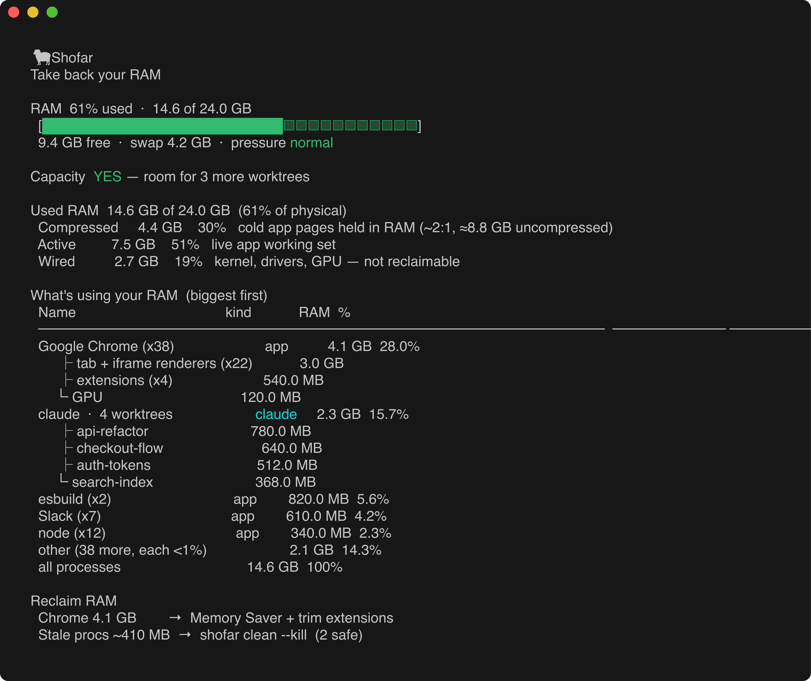

# 🐏 shofar

**Take back your RAM.** A macOS CLI that turns memory state into decisions:
*can this machine take another dev worktree, and what's safe to kill.*

Built for running lots of git worktrees with their own dev servers and
long-lived AI agent CLIs (Claude Code, Codex, cursor-agent) — the workload that
quietly piles up RAM until the machine crawls. Unlike `htop`/`btop` (which only
*display*) or Linux OOM killers (which only *react*), shofar acts: it gates new
work on real headroom and cleans up stale dev processes safely.



## Install

```sh
brew install astaub/tap/shofar            # Homebrew
go install github.com/astaub/shofar@latest  # or via Go
```

Requires macOS (uses `vm_stat`, `sysctl`, `ps`, `lsof`, `launchctl`).

## Commands

| Command | What it does |
|---------|--------------|
| `shofar status`  | Memory chart, what's using RAM (apps + agents-by-worktree), what to reclaim |
| `shofar capacity`| Can this machine take another worktree? (the agent gate) |
| `shofar clean`   | Show — or `--kill` — safe-to-kill stale dev processes |
| `shofar chrome`  | Per-tab memory via Chrome DevTools |
| `shofar cleanup` | `on`\|`off`\|`status` an hourly auto-clean LaunchAgent |
| `shofar update`  | Rebuild + reinstall from source (`--check` for staleness) |
| `shofar skill`   | Install the Agent Skill into a coding agent |

Every read command takes `--json`. `clean` is a dry run unless you pass `--kill`.

## The agent gate: `capacity`

```sh
$ shofar capacity --json
{ "ok": true, "pressure": "normal", "room_for_n": 3,
  "per_worktree_budget_bytes": 1572864000, "budget_source": "measured",
  "reason": "headroom for at least one more worktree …" }
```

An agent checks `ok` before spawning a worktree. The verdict = VM pressure (a
hard gate) + usable headroom (available − an OS reserve) ÷ a per-worktree budget
(*measured* from your live worktrees, or a default). `room_for_n` is how many
more fit.

## Use it as an agent skill

shofar ships an [Agent Skill](https://github.com/anthropics/skills)
(`skills/shofar/SKILL.md`) — the open format read by Claude Code, Codex, Cursor,
Gemini CLI, Goose, and ~30 other tools. Install it into an agent:

```sh
shofar skill install --agent claude   # → ~/.claude/skills/shofar/SKILL.md
shofar skill install --dir <path>     # any other agent's skills dir
```

The skill teaches an agent to gate on `shofar capacity --json` before spawning a
worktree, and to propose `shofar clean` when memory is tight.

## Cleanup is conservative by design

The cost of killing live work far exceeds a missed stale process, so `clean`
**never** kills: a process in its own ancestor chain, anything in an **active**
worktree (recent edits / running dev server), a session younger than the min
age, or a `protect_patterns` match. It kills the whole process subtree (so the
reported reclaim is real) and only after proving *no descendant* is protected.

Agent CLIs are eligible only when truly idle/orphaned — and a TTY-less,
recently-active worktree (how emdash/cursor run agents) is treated as **live**,
never killed.

## Config — `~/.config/shofar/config.json`

All fields optional. Worktrees are discovered recursively under each base
(nested `base/<project>/<branch>` layouts included):

```json
{
  "worktree_bases": ["~/code/worktrees", "~/emdash/worktrees", "~/.cursor/worktrees"],
  "claude_idle_hours": 6,
  "min_session_minutes": 30,
  "reserve_bytes": 3221225472,
  "protect_patterns": [],
  "cleanup_enabled": false
}
```

## Development

Checks run locally via a pre-push git hook (no hosted CI cost for releases):

```sh
git config core.hooksPath .githooks   # go vet + build + test before each push
```

CI runs tests on PRs; releases are cut locally with `goreleaser release --clean`
on a `vX.Y.Z` tag (see [CONTRIBUTING.md](CONTRIBUTING.md)).

## License

MIT © Andrew Staub
